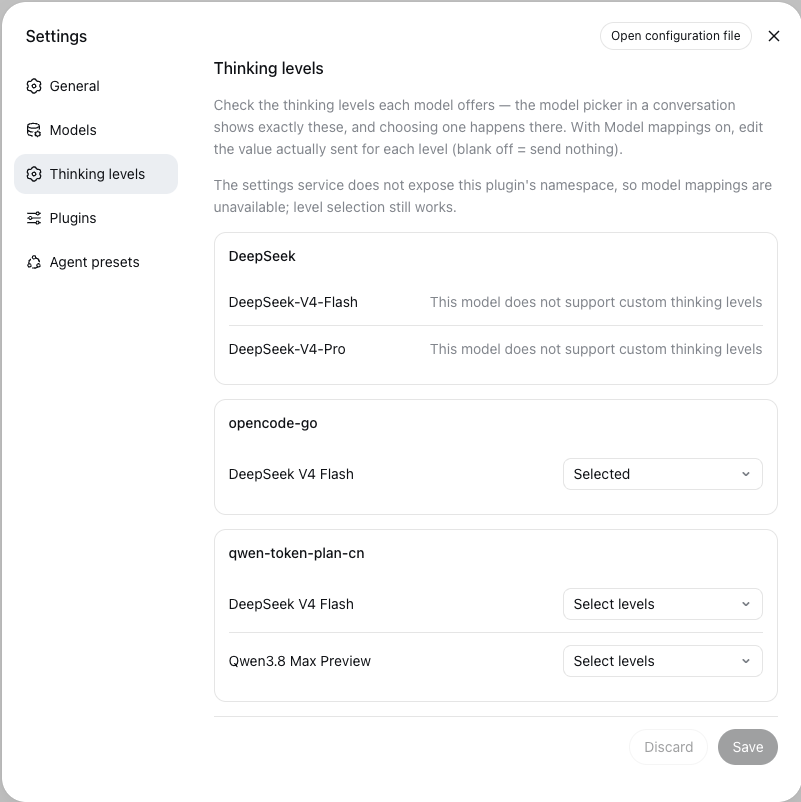
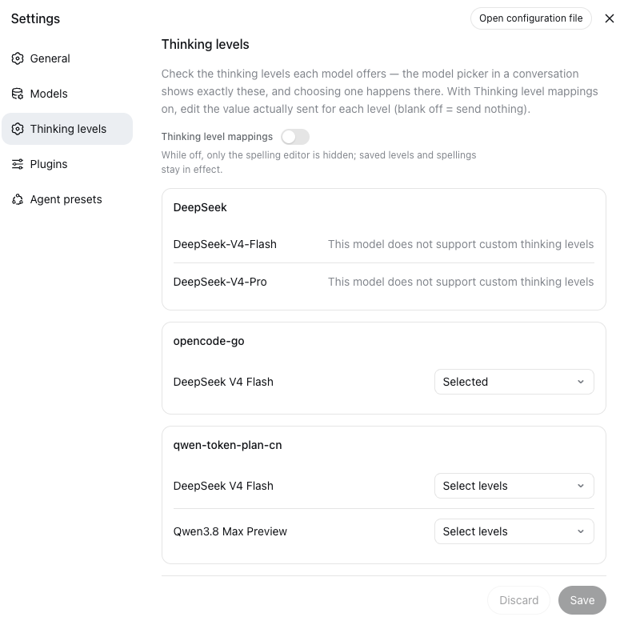

# thinking-level-override

English | [中文](README.zh.md)

A [DeepSeek Harness](https://github.com/deepseek-ai/deepseek-harness) plugin that fixes missing or mismatched thinking-level presets of third-party models: it overrides and adjusts the reasoning effort on every request, and lets you choose exactly which thinking levels each model offers.

Third-party models reach the harness through adapter catalogs whose reasoning presets do not always match reality: a selector offers a level the exact model cannot serve, a session inherits an effort across a model switch, or a deployment simply wants one level for a whole route. Left alone, such a request fails `UNSUPPORTED_REASONING_EFFORT` before it reaches the provider. This plugin intercepts the request configuration, rewrites the reasoning effort according to your rules, and repairs unserviceable levels instead of letting the request fail.

## Quick start

You can use the plugin two ways — they can be combined:

**A. Pick the offered levels on the Web settings page (no YAML).** Open the Web GUI → **Settings → Thinking levels** (right below **Models**). For each model, check the levels it can actually serve, then **Save**. The conversation's model-selection dialog now offers exactly those levels — choosing the actual level still happens in the dialog. This writes each model's `reasoningEfforts` under `llm-pi-ai` in `settings.yaml` for you.

**B. Write override rules in YAML.** Rules force, default, or remap levels per provider/model, and repair levels a model cannot serve:

```yaml
thinking-level-override:
  rules:
    # The kimi-k2 family on openrouter misreports its preset: always use high.
    - provider: openrouter
      models: ['kimi-k2*']
      effort: high
    # acme-gateway uses a different vocabulary: rename the levels, default to medium.
    - provider: acme-gateway
      map:
        max: high
        xhigh: high
      default: medium
    # legacy-gw cannot serve inherited efforts: drop them instead of failing.
    - provider: legacy-gw
      onUnsupported: drop
```

Rules are live: writes to `settings.yaml` are picked up by the next request, no restart.

## How it works

The plugin listens to the `agent/request` waterfall — the documented interception point for the frozen call configuration — and transforms the resolved `LlmCallConfig` before the LLM seam validates it against the exact model capability. It registers with `prepend`, so the override is the outermost listener and has the last word over later listeners such as model selection. The loop logs the rewritten configuration through its normal `request/header` path, so every override stays durable and reconstructable from the session log.

For each request:

1. The first rule matching `provider` (exact) and `model` (`*` globs) governs the request; later rules are ignored.
2. The effective effort is proposed: the rule's forced `effort` wins, then the request's own level (rewritten by the rule's `map` when one applies), then the rule's `default`.
3. Under `clamp` or `drop`, the plugin reads the exact model capability through `ctx.llm.resolveModelInfo()`. A model that offers the level keeps it; a model that does not is repaired per policy; a model declaring no reasoning sheds the effort. When the capability cannot be read, the request passes through unchanged and the LLM seam stays the authority.

## Install

Requires a `dsh` installation (developer preview).

**From this directory** (installs as a link — your later `pnpm run build` changes take effect immediately):

```sh
dsh plugin --profile <name> add ./thinking-level-override
```

Replace `<name>` with your profile, e.g. `web`.

**From git** — pnpm fetches sources and runs the `prepare` build; allow it in the profile's `pnpm-workspace.yaml` when pnpm asks:

```sh
dsh plugin --profile <name> add github:<you>/thinking-level-override
```

```yaml
allowBuilds:
  dsh-thinking-level-override: true
```

**For local iteration without installing**, a `--patch` overlay loads the source (or built) module directly:

```yaml
- insert:
    - id: thinking-level-override
      name: '/absolute/path/to/thinking-level-override/src/index.ts'
      config:
        rules:
          - provider: acme-gateway
            effort: high
```

After installing, restart the Web app; the **Thinking levels** entry appears in Settings.

## Web settings page




The package ships a browser half (`dsh.client` declaration, `./client` entry) that renders a **Thinking levels** entry in the Web Settings nav, directly below **Models**.

### Pick the offered levels

1. Open **Settings → Thinking levels**.
2. For each model, click the level picker (right of the model name) and check the levels the model can serve — a bare checkmark marks each selection. `off` means "thinking disabled" and is shown as such.
3. Click **Save** (bottom right). The conversation's model-selection dialog now offers exactly the checked levels; choosing the actual level stays in that dialog.

Unchecking a level removes it; clearing all levels restores the model's inherited behavior. The page writes `reasoningEfforts` into the pi-ai adapter's settings, so the model entry itself — its id, name, context window — is never touched.

### Edit the wire spelling (Thinking level mappings)

Some gateways use their own vocabulary for the levels. With the **Thinking level mappings** switch on (off by default), each checked level gains an inline text field for the value actually sent on the wire — the level name by default, `off` shown as blank (sends nothing):

```yaml
# What the page writes for: off checked (blank), high checked with "high",
# max checked with "ultra" (the dialog shows max; the wire sends ultra)
llm-pi-ai:
  providers:
    qwen-token-plan-cn:
      models:
        - id: qwen3.8-max-preview
          reasoningEfforts:
            off:
            high: high
            max: ultra
```

Existing hand-written spellings are preserved — only newly checked levels get the level name as their default, and a blank non-off spelling falls back to the level name. Two constraints come from the adapter schema: keys must be one of the seven levels (pi-ai's level set `off/minimal/low/medium/high/xhigh/max` — a key like `ultra` is rejected at write time), and only `off` may leave its value empty (send nothing). Turning the switch off only hides the editor; saved levels and spellings keep working. `settings.yaml` remains the authoritative document; the page writes through the same seam.

> **Needed only for the mappings editor: the settings-exposure allowlist.** The Web client only sees and edits settings namespaces the harness's API gateway explicitly allows; `dsh-host-apiproxy` hardcodes that boundary in `WEB_SETTINGS_NAMESPACES`. The offered-level picker writes into the pi-ai namespace, which is always exposed, so it works without any patch. Only the **Thinking level mappings** switch and editor live in the plugin's own namespace: without the patch below the page degrades gracefully — a note replaces the switch, level selection keeps working, and the section stays fully live-editable through `settings.yaml`. To enable the mappings editor, add `'thinking-level-override'` to the array in the sibling checkout's `packages/host/apiproxy/src/api-proxy.ts`, rebuild, and run the GUI from that checkout:

```sh
cd ../deepseek-harness
pnpm run build
pnpm dsh web
```

A GUI launched from `npx @deepseek-ai/dsh` instead needs the same edit in the npx install's built bundle:

```
~/.npm/_npx/<hash>/node_modules/@deepseek-ai/dsh-host-apiproxy/lib/index.js
```

Find the `WEB_SETTINGS_NAMESPACES = [` array, add `"thinking-level-override",`, save, and restart the GUI. Note that npm re-fetching the package cache reverts the edit.

## Configuration

| Field | Meaning | Default |
|---|---|---|
| `enableMappings` | Master switch for the per-model wire-spelling editor on the Web settings page | `false` |
| `onUnsupported` | What to do with an effort the exact model cannot serve: `fail` with stock harness behavior (the default — models ship their own compat layer), `clamp` to the nearest offered level, or `drop` it from the request | `fail` |
| `rules` | Override rules in precedence order | `[]` |

Each rule:

| Field | Meaning |
|---|---|
| `provider` | Exact provider route the rule governs (required) |
| `models` | Model-id globs (`*` wildcard); absent or empty governs every model on the route |
| `effort` | Force this level on every matched request, replacing any selection |
| `default` | Level applied when a matched request names none |
| `map` | Rewrite requested levels before capability validation (`requested: replacement`) |
| `onUnsupported` | Per-rule policy override |

A rule must declare at least one of `effort`, `default`, `map`, or `onUnsupported`; an actionless rule fails plugin load.

### Example configurations

Force one level for a model family whose preset misreports support:

```yaml
thinking-level-override:
  rules:
    - provider: openrouter
      models: ['kimi-k2*']
      effort: high
```

Rewrite the levels a gateway vocabulary does not accept, and default new conversations to `medium`:

```yaml
thinking-level-override:
  rules:
    - provider: acme-gateway
      map:
        max: high
        xhigh: high
      default: medium
```

Never let an inherited effort break one route's requests:

```yaml
thinking-level-override:
  rules:
    - provider: legacy-gw
      onUnsupported: drop
```

## Dynamic configuration (settings)

The plugin registers the `thinking-level-override` settings namespace with its `Config` schema and the `cordis.yml` entry as the composition base — the same seam `dsh-llm-pi-ai` uses. A user-settings layer therefore edits the rules live, with no restart: write the section into `settings.yaml` (the settings document the Web UI edits) and the next request picks it up.

```yaml
thinking-level-override:
  onUnsupported: clamp
  rules:
    - provider: qwen-token-plan-cn
      models: ['qwen3.8-max-preview']
      effort: xhigh
```

A write the schema or the rule validation refuses is rejected where it is written and the last good section keeps serving. Without a mounted settings service the entry config alone drives the plugin, unchanged.

## Uninstall

1. **Remove the plugin from the profile:**

```sh
dsh plugin --profile <name> remove dsh-thinking-level-override
```

2. **Clean the settings document.** Open `settings.yaml` and delete the `thinking-level-override:` section (the rules it stored stop applying the moment the plugin is gone, but leaving it is harmless and confusing). Optionally, also remove the `reasoningEfforts` blocks the settings page wrote under `llm-pi-ai.providers.<route>.models` if you want the models back to their inherited level presets.

3. **If you installed via `--patch` overlay**, remove the `insert` entry from your patch file instead of steps 1–2.

4. **Restart the Web app.** The **Thinking levels** entry disappears from Settings.

5. **Optional:** revert the harness `WEB_SETTINGS_NAMESPACES` edit (see [Web settings page](#web-settings-page)) if you made it only for this plugin.

## Troubleshooting

**The conversation fails with `UNSUPPORTED_REASONING_EFFORT`.** The exact model cannot serve the requested level. Either check the level off in **Settings → Thinking levels** for that model, or add a rule that forces a supported level / remaps the unsupported one (`map`) / drops it (`onUnsupported: drop`).

**`llm-pi-ai: provider "X" sets modelOverrides for "Y" beside a models list`.** pi-ai refuses a provider that declares both a `models` list and a `modelOverrides` dict — with a `models` list, every field must live on the list entries themselves. Merge the override's fields into the matching `models` entry and delete the `modelOverrides` block.

**The settings page shows "settings service unavailable".** The page degrades when the plugin's namespace is not exposed: level selection still works, and only the mappings switch shows an unavailable note (the harness allowlist keeps model-provider namespaces like `llm-pi-ai` exposed by default). If you want the mappings editor, apply the patch under [Web settings page](#web-settings-page); until then, edit `settings.yaml` directly — rules are live either way.

**I checked levels and saved, but the conversation dialog shows no level options.** Confirm the save succeeded (the page shows "Saved"), then check `settings.yaml` for the `reasoningEfforts` block under `llm-pi-ai.providers.<route>.models.<id>` — it is written into the model's own entry, not a `modelOverrides` block. Restart the Web app so the catalog reloads.

**`allowBuilds` warning during git install.** pnpm blocks the `prepare` build of git-installed packages; add the shown key to the profile's `pnpm-workspace.yaml` and re-run the install.

## Clamping

Clamp distance is measured on the canonical escalation ladder `off < minimal < low < medium < high < xhigh < max` — pi-ai's level set, which supersedes the DeepSeek adapter's `off`/`high`/`max`. On a distance tie the lower level wins. A requested id outside the ladder takes the highest offered level; effort ids an adapter offers outside the ladder sort after every known level in the adapter's reported order.

## Scope and limitations

- Governs conversation requests dispatched through the agent loop's `agent/request` waterfall, including subagents. Direct `ctx.llm.stream()` callers with their own configs — session titles, compaction — are unaffected.
- Cannot add reasoning capability an adapter does not declare: a model whose catalog entry carries no reasoning metadata sheds every effort under `clamp`/`drop` and fails under `fail`. Wire-level preset repair (offered levels and their spellings) belongs to the adapter's own configuration — for `@deepseek-ai/dsh-llm-pi-ai`, the `modelOverrides` and `reasoningEfforts` fields in its settings section.
- The first matching rule wins; overlapping rules do not merge.
- Under `onUnsupported: fail`, forced/mapped/defaulted efforts apply without capability validation, so a misconfigured force still fails loud at the LLM seam.
- The settings section is edited through the settings document (the `thinking-level-override:` key in `settings.yaml`) and is discoverable via `settings.describe`. The in-page editor additionally needs the harness exposure-allowlist patch documented under [Web settings page](#web-settings-page); without it the section remains fully live-editable through `settings.yaml`.

## Development

This repository develops against a sibling `deepseek-harness` checkout (../deepseek-harness) that has completed the run-from-source path (`pnpm install`). Type checking resolves harness packages to that checkout's source through project references; tests run the real `LlmRuntime` seam with a stub adapter and dispatch `agent/request` through a scope carrier the way the agent loop does.

```sh
pnpm install
pnpm test        # vitest: engine, schema, controller, and plugin-integration suites
pnpm typecheck   # tsc -b over src + tests against the harness checkout
pnpm build       # tsc declarations + tsdown bundle into lib/
```

The `prepare` script builds `src/` self-contained for git installs and needs no harness checkout; it does not type-check.

### AI-assisted development

This codebase is primarily written with the assistance of AI coding tools — specifically DeepSeek V4 Flash running inside DeepSeek Harness. The maintainer owns the product direction, requirements, and testing; changes are reviewed and covered by the test suite before release.

## License

[Apache-2.0](LICENSE)
